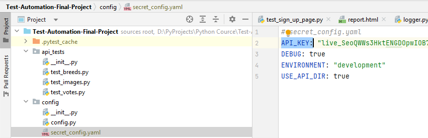

# TheCatAPI Automation


## Key Elements of the README:
1. **Project Overview:** Describes the purpose and main technologies used in the project.
2. **Project Structure:** Provides a clear outline of the project's directory and files structure.
3. **Setup Instructions:** Includes step-by-step instructions on how to set up environment to run the tests.
4. **Running Tests:** Offers commands to run tests in different configurations.
5. **Tests Result Analysis :** Notes about where to find test reports and logs and how logging and reporting are set up.


## Project Overview
This project contains automated tests for The Cat API (https://thecatapi.com/). It includes both API and UI tests to ensure extensive coverage of functionalities provided by The Cat API. The tests are built using Python with Pytest for running tests, Requests for API interaction, and Playwright for UI testing.


## Project Structure
This structure is formatted to visually represent the hierarchy of main directories and files in the project. Each directory and file is listed with a brief description (as comments) to explain its purpose or contents.

TheCatAPI_Automation/
```│
├── api_tests/                       # Folder for API tests
│   ├── __init__.py
│   ├── conftest.py                  # Contains fixtures for API tests
│   ├── test_categories.py           # Example test file for "categories" endpoint
│   ├── test_votes.py                # Example test file for "votes" endpoint
│   └── test_breeds.py               # Example test file for "breeds" endpoint
│
├── ui_tests/                        # Folder for UI tests
│   ├── __init__.py
│   ├── conftest.py                  # Contains fixtures for UI tests
│   ├── page_objects/                # Page objects for UI components
│   │   ├── __init__.py
│   │   ├── base_page.py             # Base class for common page methods
│   │   ├── home_page.py             # Page object for the homepage
│   │   ├── documentation_page.py    # Page object for the documentation page
│   │   └── sign_up_page.py          # Page object for the sign-up page
│   ├── test_home_page.py            # Example test file for "homepage" endpoint
│   ├── test_documentation_page.py   # Example test file for "documentation" endpoint
│   └── test_sign_up_page.py         # Example test file for "sign-up" endpoint
│
├── utils/                           # Utilities and helpers for both API and UI tests
│   ├── __init__.py
│   ├── logger.py                    # Setup custom logger for the tests
│   └── reporter.py                  # Handles generating and managing reports
│
├── reports/                         # Folder to store test reports
│   ├── api_reports/
│   └── ui_reports/
│
├── config/                          # Configuration files
│   ├── __init__.py
│   ├── config.py                    # General configuration settings
│   └── secret_config.yaml           # Contains sensitive configuration details
│
├── requirements.txt                 # Python libraries required by the project
├── README.md                        # Project overview and setup instructions
├── .gitignore                       # Specifies intentionally untracked files to ignore
├── pytest.ini                       # Contains pytest-specific settings
└── conftest.py                      # Global test fixtures and setup functions
```


## Setup Instructions

### Prerequisites
- Python 3.7 or higher
- pip (Python package installer)
- The Cat API! access 

These instructions will guide you through setting up your The Cat API! access and getting your unique API key:
- Enter your email address here to get free or premium access to the API.
- Check your emails. Look out for an email that contains the subject '🐈 Welcome to The Cat API!' (Or Dog!). Check your spam folder if it has not arrived.
- Copy and store the API key somewhere safe. It should look something like this: live_T941odOy4hS460HfhmmTsDmaZPsmN9eJYrXXjVXnhhco1dChfwsI...


### Installation
To run TheCatAPI Automation project locally, you'll need to follow a series of steps to set up your environment, install dependencies, and execute the tests. Below is a detailed, step-by-step guide to get you started:


**Step 1:** Clone the Repository
```
bash
git clone https://github.com/Mihalochkina/Test-Automation-Final-Project.git
cd TheCatAPI_Automation
```
**Step 2:** Set Up Python Environment
It's recommended to use a virtual environment to manage the dependencies for the project separately from your global Python installation.
*For Windows:*
```
bash
python -m venv venv
.\venv\Scripts\activate
```

*For macOS/Linux:*
```
bash
python3 -m venv venv
source venv/bin/activate
```
**Step 3:** Install Dependencies
Install all the required Python libraries specified in the requirements.txt file.
```
bash
pip install -r requirements.txt
```
**Step 4:** Configure Environment Variables
Go to the config project directory and change API_KEY in secret_config.yaml file to API_KEY from the Prerequisites section:



## Running Tests
Navigate to the root directory of your project where the test files are located. You can run the tests using a test runner like pytest.

- **Run all tests:**
```
bash
pytest
```

- **Run only API tests:**
pytest api_tests/
```
bash
pytest api_tests/
```
- **Run only UI tests:**
pytest ui_tests/
```
bash
pytest ui_tests/
```
- **Run tests with specific marker (e.g., smoke tests):**
pytest -m smoke
```
bash
pytest -m smoke
```
markers:
- smoke: mark a test as part of the smoke test suite.
- regression: mark a test as part of the regression test suite.
- api: mark a test related to API testing.
- ui: mark a test related to UI testing.


## Tests Result Analysis 

### Reporting

- Test reports are generated in the `reports/` directory after the execution of corresponding tests.

### Logging

- Custom logging is set up under the `utils/` directory and can be imported and used in any of the test modules.


