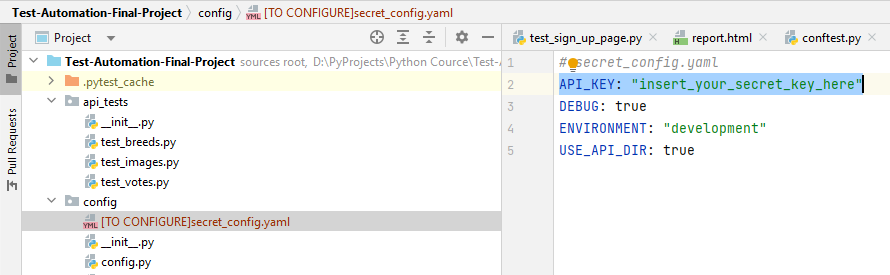

# TheCatAPI Automation
</br>

## Key Elements of the README:

1. **Project Overview:** Describes the purpose and main technologies used in the project.
2. **Project Structure:** Provides a clear outline of the project's directory and files structure.
3. **Setup Instructions:** Includes step-by-step instructions on how to set up environment to run the tests.
4. **Running Tests:** Offers commands to run tests in different configurations.
5. **Tests Result Analysis :** Notes about where to find test reports and logs and how logging and reporting are set up.
</br>

## Project Overview

This project contains automated tests for The Cat API (https://thecatapi.com/). It includes both API and UI tests to
ensure extensive coverage of functionalities provided by The Cat API. The tests are built using Python with Pytest for
running tests, Requests for API interaction, and Playwright for UI testing.<br> 
**Code Quality:** black tool is used to format files and flake8 to find warning or errors.
</br>
</br>

## Project Structure

This structure is formatted to visually represent the hierarchy of main directories and files in the project. Each
directory and file is listed with a brief description (as comments) to explain its purpose or contents.

TheCatAPI_Automation/

```│
├── api_tests/                       # Folder for API tests
│   ├── __init__.py
│   ├── conftest.py                  # Contains fixtures for API tests
│   ├── test_categories.py           # Example test file for "categories" endpoint
│   ├── test_votes.py                # Example test file for "votes" endpoint
│   └── test_breeds.py               # Example test file for "breeds" endpoint
│
├── ui_tests/                        # Folder for UI tests
│   ├── __init__.py
│   ├── conftest.py                  # Contains fixtures for UI tests
│   ├── page_objects/                # Page objects for UI components
│   │   ├── __init__.py
│   │   ├── base_page.py             # Base class for common page methods
│   │   ├── home_page.py             # Page object for the homepage
│   │   ├── documentation_page.py    # Page object for the documentation page
│   │   └── sign_up_page.py          # Page object for the sign-up page
│   ├── test_home_page.py            # Example test file for "homepage" endpoint
│   ├── test_documentation_page.py   # Example test file for "documentation" endpoint
│   └── test_sign_up_page.py         # Example test file for "sign-up" endpoint
│
├── utils/                           # Utilities and helpers for both API and UI tests
│   ├── __init__.py
│   ├── logger.py                    # Setup custom logger for the tests
│   └── reporter.py                  # Handles generating and managing reports
│
├── reports/                         # Folder to store test reports
│   ├── allure_reports/
│   └── html_report/
│
├── config/                                # Configuration files
│   ├── __init__.py
│   ├── config.py                          # General configuration settings
│   └── [TO CONFIGURE]secret_config.yaml   # Contains sensitive configuration details
│
├── requirements.txt                 # Python libraries required by the project
├── README.md                        # Project overview and setup instructions
├── .gitignore                       # Specifies intentionally untracked files to ignore
├── pytest.ini                       # Contains pytest-specific settings
├── .flake8                          # Contains flake8 specific settings
└── conftest.py                      # Global test fixtures and setup functions
```
</br>

## Setup Instructions

### Prerequisites

- Python 3.7 or higher
- pip (Python package installer)
- The Cat API! access

These instructions will guide you through setting up your The Cat API! access and getting your unique API key:

- Enter your email address here to get free or premium access to the API.
- Check your emails. Look out for an email that contains the subject '🐈 Welcome to The Cat API!' (Or Dog!). Check your
  spam folder if it has not arrived.
- Copy and store the API key somewhere safe. It should look something like this:
  live_T941odOy4hS460HfhmmTsDmaZPsmN9eJYrXXjVXnhhco1dChfwsI...

### Installation

To run TheCatAPI Automation project locally, you'll need to follow a series of steps to set up your environment, install
dependencies, and execute the tests. Below is a detailed, step-by-step guide to get you started:

**Step 1:** Clone the Repository

```bash
git clone https://github.com/Mihalochkina/Test-Automation-Final-Project.git
cd TheCatAPI_Automation
```
</br>

**Step 2:** Set Up Python Environment
It's recommended to use a virtual environment to manage the dependencies for the project separately from your global
Python installation.

*For Windows:*

```bash
python -m venv venv
.\venv\Scripts\activate
```

*For macOS/Linux:*

```bash
python3 -m venv venv
source venv/bin/activate
```
</br>

**Step 3:** Install Dependencies
Install all the required Python libraries specified in the requirements.txt file.

```
bash
pip install -r requirements.txt
```
</br>

**Step 4:** Playwright installation 
Once Playwright is installed in scope of requirements.txt, you need to run the playwright installation command to
download the necessary browsers:

```bash
playwright install
```
</br>

**Step 5:** Configure Environment Variables
- Go to the config project directory and change API_KEY in [TO CONFIGURE]secret_config.yaml file to API_KEY from the
Prerequisites section:



- Rename [TO CONFIGURE]secret_config.yaml to secret_config.yaml
</br>

## Running Tests

Navigate to the root directory of your project where the test files are located. You can run the tests using a test
runner like pytest.

- **Run all tests:**

```bash
pytest
```

- **Run only API tests:**
  pytest api_tests/

```bash
pytest api_tests/
```

- **Run only UI tests:**
  pytest ui_tests/

```bash
pytest ui_tests/
```

- **Run tests with specific marker (e.g., smoke tests):**
  pytest -m smoke

```bash
pytest -m smoke
```

markers:

- smoke: mark a test as part of the smoke test suite.
- regression: mark a test as part of the regression test suite.
- api: mark a test related to API testing.
- ui: mark a test related to UI testing.
</br>

## Tests Result Analysis

### Reporting

#### Overview
Test reports are automatically generated and stored in the `reports/` directory after the execution of the corresponding tests. These reports provide detailed insights into the test executions, helping you to analyze test outcomes efficiently.

#### HTML Report
- **Location**: `reports/html_report/report.html`
- **Description**: This HTML report contains information about all the tests that were run, regardless of whether a specific suite or all tests were executed. The report is updated with each test execution and only contains data from the most recent run. This ensures that the report always reflects the latest state of your test suite.

#### Allure Reports
- **Location**: `reports/allure_reports/`
- **Description**: The Allure framework generates more comprehensive test reports, which include various files such as JSON and attachment files. These files are used by the Allure dashboard to render detailed test execution insights, which are helpful for in-depth analysis.
- **Example Files**:
  - `2df1ca3d-387c-455f-a10c-5a8066b53856-result.json`: Contains the results of the test executions.
  - `3b45a46c-4009-4c69-af95-99694906c32e-attachment.txt`: Includes attachments such as logs, screenshots, etc.
  - `3bdfbda5-a307-4510-a0a0-27b05de5d649-container.json`: Stores metadata about the test environment and test run.

#### Viewing Reports
To view the HTML report, simply open the `report.html` file in any web browser. For a more detailed analysis using Allure reports, you can generate and serve the Allure report locally using the following commands:

```bash
# Generate the Allure report
allure generate reports/allure_reports/ -o reports/allure_report --clean

# Serve the report on a local server
allure serve reports/allure_report 
```

### Logging

#### Overview
In this project, we use the `loguru` library for its flexible and powerful logging capabilities.

#### Configuration
The logging setup is managed by the `logger.py` module, which configures the `loguru` logger to write logs to files in the `logs/` directory. Each log file is named with the timestamp of when the logging started, ensuring that log files are uniquely identifiable and organized chronologically.

#### Log Files
- **Location**: All log files are stored in the `logs/` directory at the root of the project.
- **Naming Convention**: Log files are named in the format `test_log_{YYYY-MM-DD_HH-MM-SS}.log`, where the date and time represent when the logging was initiated.
- **Rotation and Compression**: Each log file has a maximum size of 10 MB. When this size is exceeded, the log file is closed, compressed into a ZIP file, and a new log file is started.

#### Log Format
Logs are formatted to provide a comprehensive view of each event:<br>
{time:YYYY-MM-DD at HH:mm:ss} | {level} | {message} | {file}:{function}:{line} | {exception}

- **Time**: The timestamp of when the log entry was created.
- **Level**: The severity level of the log entry (e.g., DEBUG, INFO, WARNING, ERROR).
- **Message**: The log message describing the event.
- **File, Function, Line**: The source file, function, and line number where the log entry was generated.
- **Exception**: Any exception traceback associated with the log entry (if applicable).

#### Usage
To use the configured logger in your Python scripts, import the `logger` from `logger.py`:
```python
from logger import logger

logger.info("This is an informational message")
logger.error("This is an error message")
```
The logger supports various levels of severity, including debug, info, warning, error, and critical.

#### Viewing Logs
To view the logs, navigate to the logs/ directory and open the desired log file. The files can be opened with any text editor or log viewer that supports plain text files.


